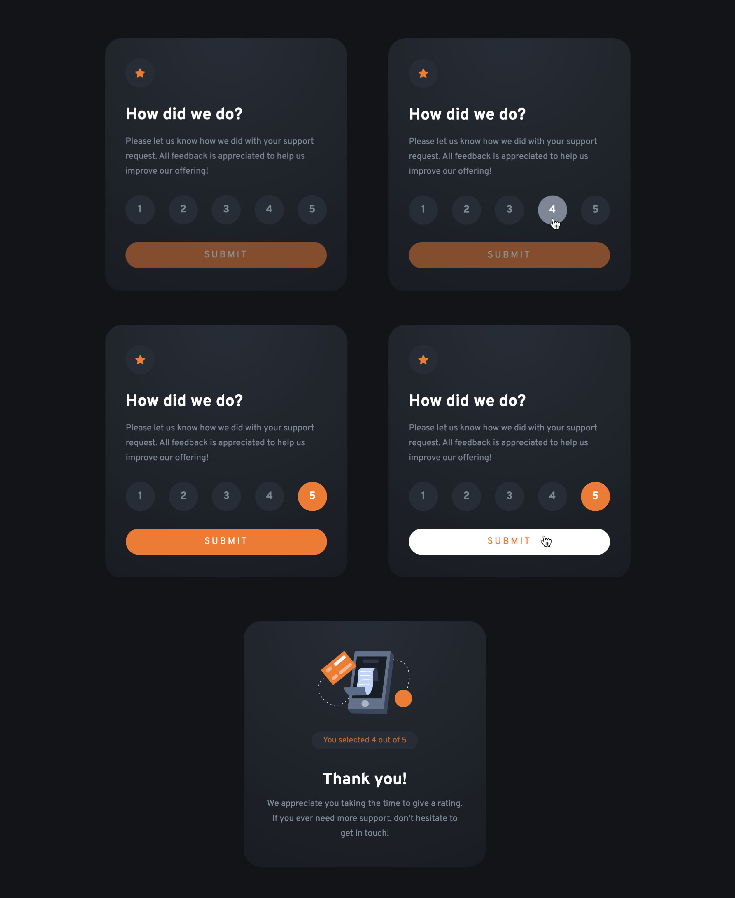

# Frontend Mentor - Interactive rating component solution

This is a solution to the [Interactive rating component challenge on Frontend Mentor](https://www.frontendmentor.io/challenges/interactive-rating-component-koxpeBUmI).

- [Frontend Mentor - Interactive rating component solution](#frontend-mentor---interactive-rating-component-solution)
  - [Overview](#overview)
    - [The challenge](#the-challenge)
    - [Screenshot](#screenshot)
    - [Links](#links)
  - [My process](#my-process)
    - [Built with](#built-with)
    - [What I learned](#what-i-learned)
    - [Continued development](#continued-development)
  - [Author](#author)


## Overview

### The challenge

Users should be able to:

- View the optimal layout for the app depending on their device's screen size
- See hover states for all interactive elements on the page
- Select and submit a number rating
- See the "Thank you" card state after submitting a rating

### Screenshot




### Links

- Solution URL: [Files on Github](https://github.com/mindful108/frontendmentor-interactive-rating-component.git)
- Live Site URL: [Interactive Solution on Github Pages](https://mindful108.github.io/frontendmentor-interactive-rating-component)

## My process

### Built with

- Semantic HTML5 markup
- CSS with custom properties (variables)
- CSS animations
- CSS Gradients
- Flexbox
- Mobile-first workflow
- Plain JavaScript

### What I learned

This was a fun challenge for implementing some basic interactivity and animations with a combination of CSS and JavaScript, and working on refining an already excellent design.

**The design**
The style-guide did not provide details on the background which appeared to be a gradient. I could detect a radial gradient from the compression banding in the JPEG design file and from my past experience was able to recreate a pretty satisfying solution with a gradient radiating out from the top center.

```css
.card {
  background: rgb(37, 45, 55);
  background: radial-gradient(
    circle at top,
    rgba(37, 45, 55, 1) 0%,
    rgba(18, 20, 23, 1) 150%
  );
}
```
As can be seen in the screenshot above, I added an 'inactive' state to the submit button, with a popup tip to select a number, until a rating number is selected by the user, then making the button bright and active.

**CSS Animation**
I added a CSS animation to the tooltip, which is an ```::after``` pseudo element on the submit button, then another to pulse the computer icon on the thank you screen.


### Continued development

I plan to do more Frontend Mentor projects to continue developing my speed and workflow using my own custom snippets and starter templates. I will also start to use Tailwind CSS and as I learn React I'll start using that for more interactive challenges.

## Author

- Website - [Judah Lynn](https://judahlynn.com)
- Frontend Mentor - [@mindful108](https://www.frontendmentor.io/profile/mindful108)